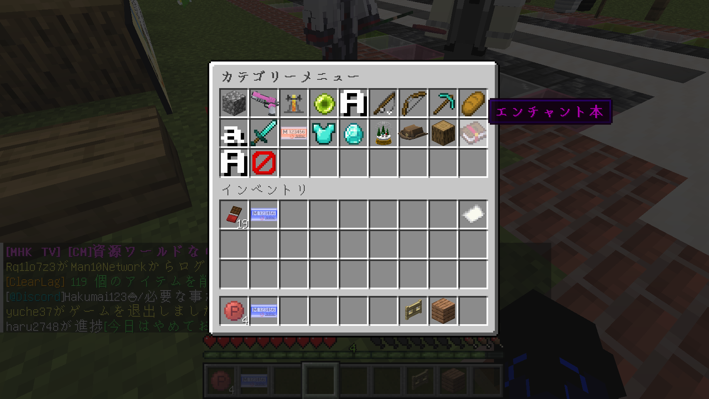
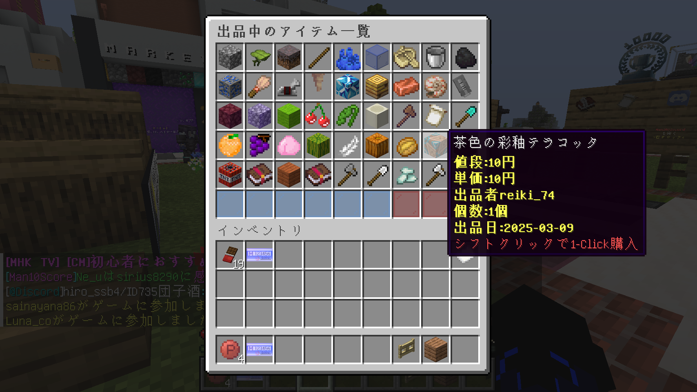
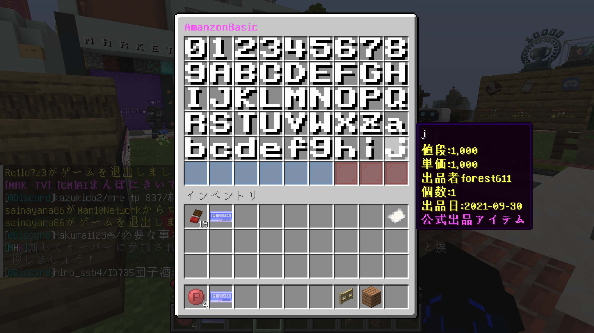

# Man10Commerce (Amanzon)

Minecraftサーバー内でプレイヤー間のアイテム取引を可能にするプラグインです。プレイヤーは自分のアイテムを出品し、他のプレイヤーはそれを購入することができます。

## 主な機能

### アイテム出品システム
- プレイヤーは自分のアイテムを指定した価格で出品可能
- 出品数と価格に上限・下限あり
- 出品期限は1週間

### カテゴリーメニュー
- アイテムを種類別に分類して表示
- カスタムカテゴリー設定可能
- 直感的なアイコンで分かりやすいインターフェース



**注意**: スクリーンショットに表示されるアイテムやテクスチャはリソースパックのものを使用しています。

### アイテム購入システム
- カテゴリー別にアイテムを閲覧可能
- 検索機能（アイテム名、素材、出品者、エンチャント）
- ワンクリックで購入可能



**注意**: スクリーンショットに表示されるアイテムやテクスチャはリソースパックのものを使用しています。

### 同じアイテムの価格比較
- 同じアイテムの出品を価格順に表示
- 最安値から順番に購入可能
- 価格差が一目でわかる表示


**注意**: スクリーンショットに表示されるアイテムやテクスチャはリソースパックのものを使用しています。

### Amanzon Basic
- 公式が販売しているアイテムを購入可能
- 常時在庫あり



**注意**: スクリーンショットに表示されるアイテムやテクスチャはリソースパックのものを使用しています。

## コマンド一覧

### 一般ユーザー向けコマンド
| コマンド | 説明 | 権限 |
|---------|------|------|
| `/amzn` | メインメニューを開く | commerce.user |
| `/amsell <価格>` | 手に持っているアイテムを出品する | commerce.user |
| `/amsearch <検索語>` | アイテム名で検索する | commerce.user |
| `/amauthor <出品者名>` | 出品者名で検索する | commerce.user |

### 管理者向けコマンド
| コマンド | 説明 | 権限 |
|---------|------|------|
| `/amsellop <価格>` | 管理者として出品する（Amanzon Basic） | commerce.op |

## 権限
| 権限 | 説明 |
|------|------|
| commerce.user | 一般ユーザー向け機能の使用権限 |
| commerce.op | 管理者向け機能の使用権限 |

## インストール方法

1. プラグインJARファイルをサーバーの`plugins`フォルダに配置します
2. サーバーを再起動するか、`/reload`コマンドを実行します
3. 設定ファイルを編集して必要な設定を行います

## 依存プラグイン

- **必須**: Man10Bank
- **推奨**: Man10CommonLibs

## 設定方法

### config.yml
```yaml
mysql:
  db: man10_commerce # データベース名
  pass: password # パスワード
  host: localhost # ホスト名
  port: 3306 # ポート
  user: root # ユーザー名
fee: 0.1 # 取引手数料（10%）
minPrice: 10.0 # 最低価格
maxPrice: 100000000.0 # 最高価格
maxItems: 54 # 一般ユーザーの最大出品数
enable: true # プラグインの有効/無効
```

### カテゴリー設定
`plugins/Man10Commerce/categories/`フォルダ内にYAMLファイルを作成することで、アイテムのカテゴリーを設定できます。

例: `blocks.yml`
```yaml
name: "ブロック" # カテゴリー名
icon: # カテゴリーアイコン
  material: GRASS_BLOCK
  name: "§a§lブロック"
  lore:
    - "§fブロック系アイテム"
materials: # このカテゴリーに含まれる素材
  - GRASS_BLOCK
  - DIRT
  - STONE
```

## 開発者情報

- 開発: [Man10 Project](https://man10.red)
- バージョン: 1.0
- 対応MC: 1.19+
